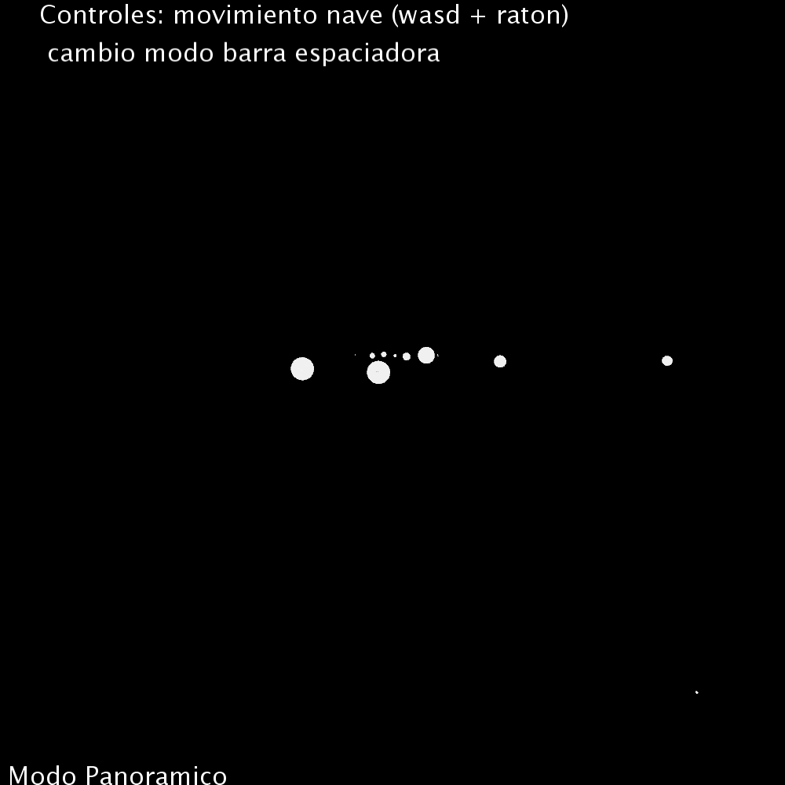

# CIU_sistema_nave
 
```
La tarea anterior abordaba la definición de un sistema planetario que incluía una nave.
Diseñar un mecanismo de interacción que permite colocar el la localización de la nave
una cámara, facilitando por tanto la modificación de su localización, además de facilitar
orientarla para indicar el punto al que se desea mirar, y la vertical. El prototipo final debe
permitir que se alterne entre una vsita general y la vista desde la nave.
Sistema planetario con movimiento de cámara entre los planetas. SolarSystemSImple lo
hace con elipses, pasarlo a esferas y poder mover la cámara, que sería nuestra nave espacial.
Posición en el espacio, y rotaciones
La entrega se debe realizar a través


```



```
Autor Leopoldo lopez reveron 
Escuela de ingeniería informática
Universidad de las palmas de Gran Canaria
```
  
# Trabajo realizado

```
  Se ha desarrollado un simulador de un sistema planetario, ademas de la posibilidad de moverse con una nave mediante la herramienta processing,
  en la cual se han tenido en cuenta las siguientes características:
  
    - Punto central sobre el que orbitan las estrellas
    - Nombres de planetas relevantes
    - Ajuste de tamaños, velocidades y distancias a la hora de representarlos
    - Astro sobre el que se orbita
    - movimiento camara
    - suplir problema de movimiento en 3 dimensiones


  El sistema representado se corresponde con el sistema solar, al cual se le ha modificado lo siguiente:
    
    -sistema binario de estrellas
    -agujero negro central
    -se ha recortado su tamaño hasta Ceres
    -se han simplicado la cantidad de lunas 
    
 ```   
    
# Decisiones adoptadas para la solución propuesta

```
  Sin tiempo, por lo que se ha hecho lo extrictamente especificado en la practica
  
  Al carecer de aparatos con giroscopio o ratones 3-D, se ha suplico con la implementacion de un sistema dual:
   eje x z, controlados por las teclas wasd -> (eje x -> w s) (eje z -> a d)
   eje x, y, controlados por el raton
 
  Para las físicas de movimiento de los planetas se ha simplificado su cálculo, reduciéndolo a orbitas circulares, las cuales pueden estar rotados cierto angulo
  
  Para resolver el problema del solapamiento de la imagen con el sistema representado, se ha reescalado la image y posteriormente se dezplaza en el eje Z
  
  Para ver el sistema en su totalidad el angulo de vision se ha rotado 30º, pudiendo de esta forma ver con mayor claridad el movimiento de los astros
 
  La colision de objetos no se tiene en cuenta
  

```

# Referencias y herramientas utilizadas

  
  - ## Funcionamiento Processing
  - * [Documentacion dibujar texto](https://processing.org/reference/text_.html)
  
  - ## Definición de especificación del proyecto
  - [Guion practica](https://ncvt-aep.ulpgc.es/cv/ulpgctp21/pluginfile.php/412240/mod_resource/content/37/CIU_Pr_cticas.pdf)


